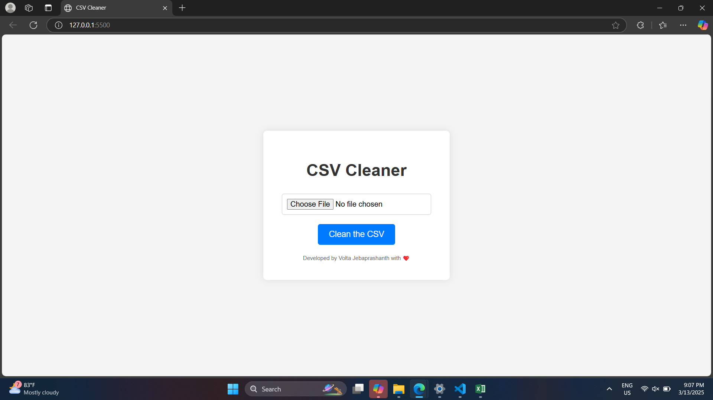
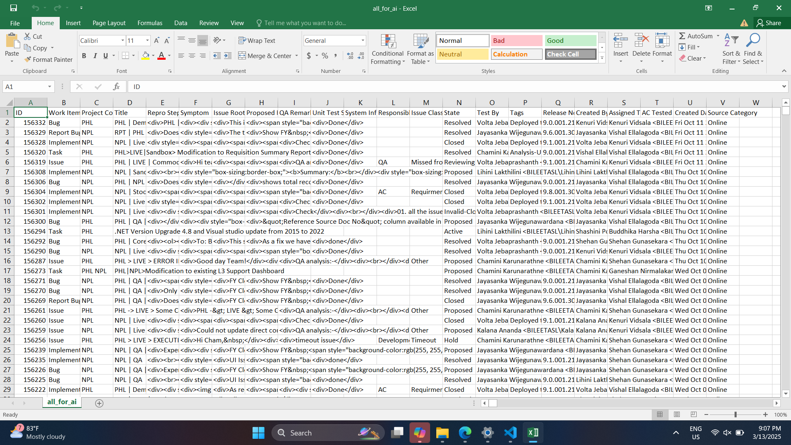
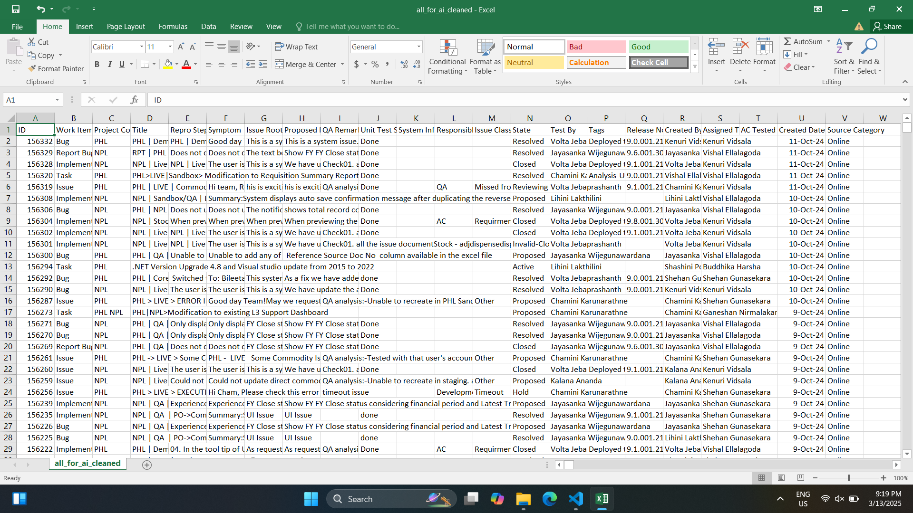

# 🚀 CSV Cleaner

## 🌟 Overview

CSV Cleaner is **built to remove HTML tags from raw work item data exported from Azure TFS**. If you frequently deal with messy CSV exports full of unwanted HTML, this tool will clean and format them instantly! 💡

For more details, contact:
Volta Jebaprashanth
📧 voltajeba@gmail.com
📞 +94774637185

🔗 **Live Preview:** [CSV Cleaner](https://voltajebaprashanth97.github.io/CSV_Cleaner/)

## ✨ Features

✅ **Removes unwanted HTML tags** and encoded entities 🔍

✅ **Formats date strings** into a human-readable format (e.g., `dd-MMM-yyyy`) 📅

✅ **Maintains proper CSV structure** while cleaning 🛠️

✅ **Simple and intuitive interface** – no coding required! 🚀

## 🛠️ How to Use

1️⃣ Open `index.html` in your favorite web browser 🌐

2️⃣ Select your CSV file 📂

3️⃣ Click the **"Clean CSV"** button ✨

4️⃣ Download your freshly cleaned CSV file automatically 🎉

If you have the same issue of HTML clutter in your **Azure TFS work item exports**, give this tool a try! ✅

## 📂 Project Structure

📌 **index.html** – The backbone of the tool, providing the UI.

📌 **styles.css** – Makes everything look sleek and modern.

📌 **script.js** – The magic behind the cleaning process.

## ⚡ Installation

No setup needed! Just **open `index.html` in a browser**, and you're ready to clean your CSV files in seconds. 🚀

## 📜 License

This project is open-source under the **MIT License**. Feel free to use and modify it as you like. 🌎

## 🤝 Contribute

Got ideas for improvement? **Fork this repository, enhance the tool, and submit a pull request!** We welcome contributions from the community. 🛠️✨

## 🤝 Screenshots
User interface

Input CSV

Cleaned CSV

